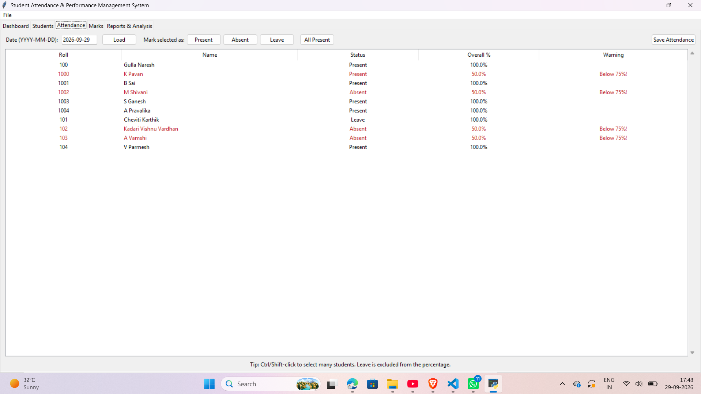
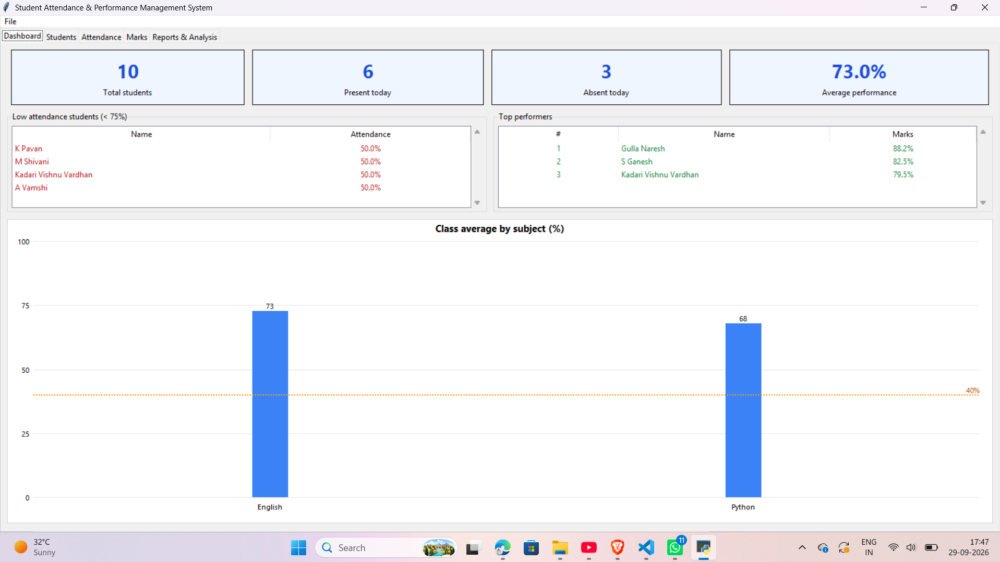
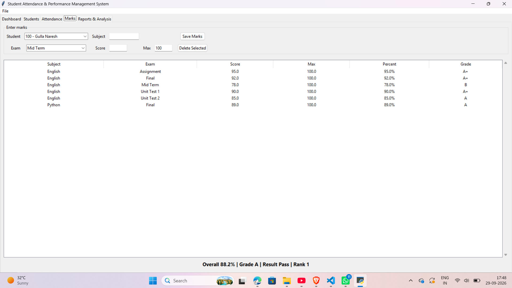
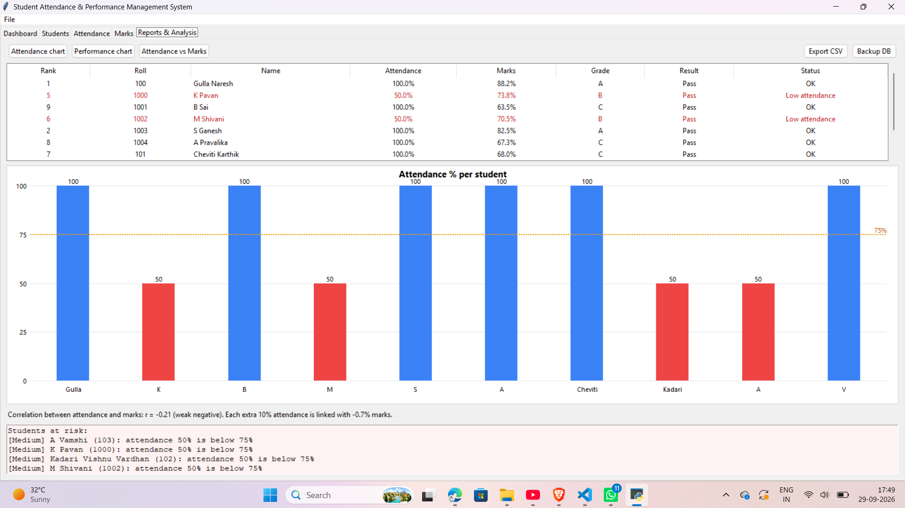
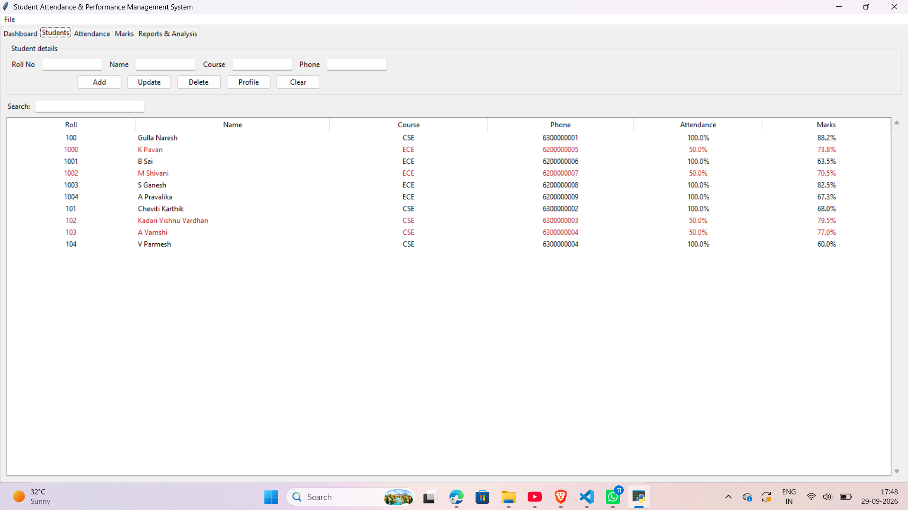

<<<<<<< HEAD
# Student Attendance & Performance Management System Using Python

A Python-only desktop application (Tkinter GUI + SQLite database) to manage students, attendance, marks, grades, rankings, dashboards, charts and at-risk student detection.

**Pure Python, standard library only. No `pip install` needed.**

## Features
| Module | What it does |
|---|---|
| Students | Add, update, delete, live search, student profile |
| Attendance | Date-wise Present / Absent / Leave, auto percentage, 75% warning, monthly attendance |
| Marks | Subject-wise and exam-wise marks, total, average, grade, pass/fail, rank |
| Dashboard | Total students, present/absent today, class average, low-attendance list, top 3, subject chart |
| Reports | Class report, attendance chart, performance chart, attendance-vs-marks scatter plot |
| Analytics | Pearson correlation + linear regression (written in pure Python) to flag at-risk students |
| Data | CSV export, database backup, demo data loader |

## Project structure
```
student-management-system/
  main.py            Tkinter GUI (5 tabs)
  database.py        SQLite layer + business logic + analytics
  charts.py          Charts drawn on Tkinter Canvas
  tests/             Unit tests (python -m unittest discover -s tests)
  docs/              Project documentation + viva Q&A
  requirements.txt
```

## Run
```
python main.py
```
`student_management.db` is created automatically on first run.
Use **File > Load sample data** to fill the app with 10 demo students for testing and screenshots.

## How the logic works
- Attendance % = Present / (Present + Absent) x 100. Approved Leave is excluded.
- Grades: A+ (90+), A (80+), B (70+), C (60+), D (50+), E (40+), F (below 40).
- Rank: by overall marks percentage; ties share a rank.
- Risk detection: attendance below 75%, marks below pass mark, or predicted marks (from the attendance-marks regression line) below 50%.

## Screenshots





## Author
Gulla Naresh
=======
# -Student-Attendance-Performance-Management-System-using-python
   Student Attendance Performance Management System using python
>>>>>>> 0af91c12ab1d10d950e10610397e44b41b243233
